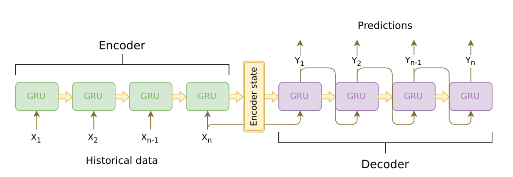
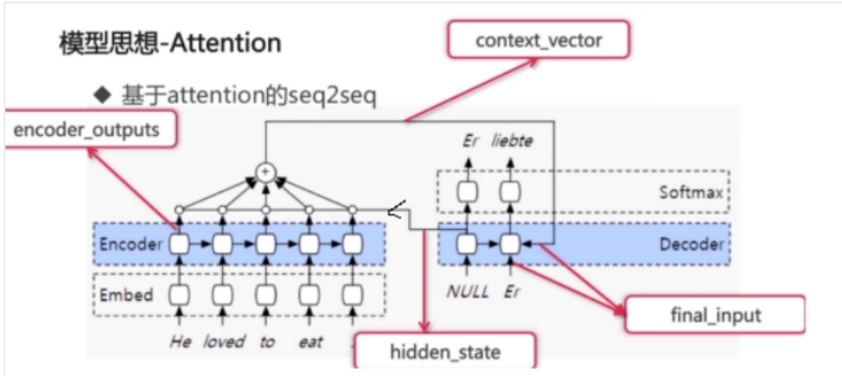
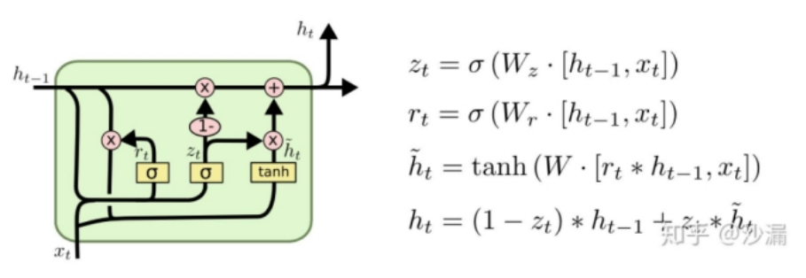
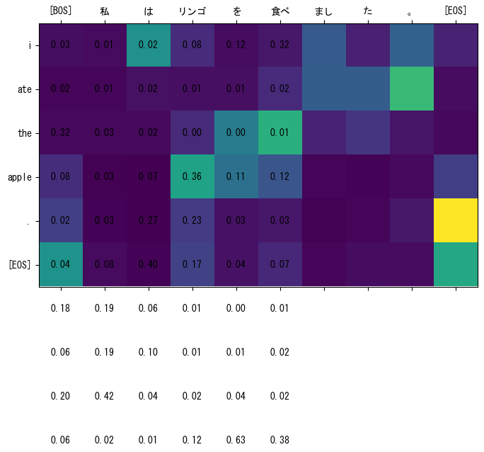
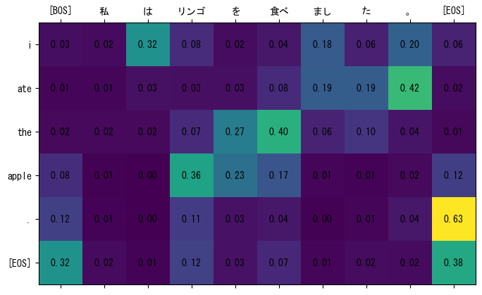
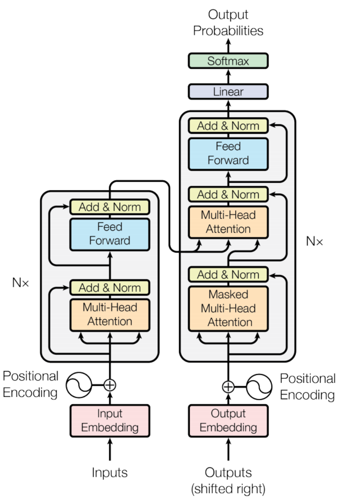
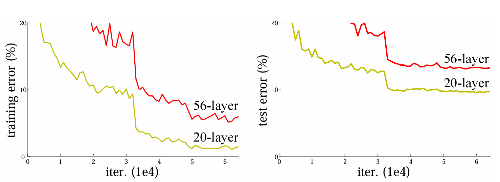
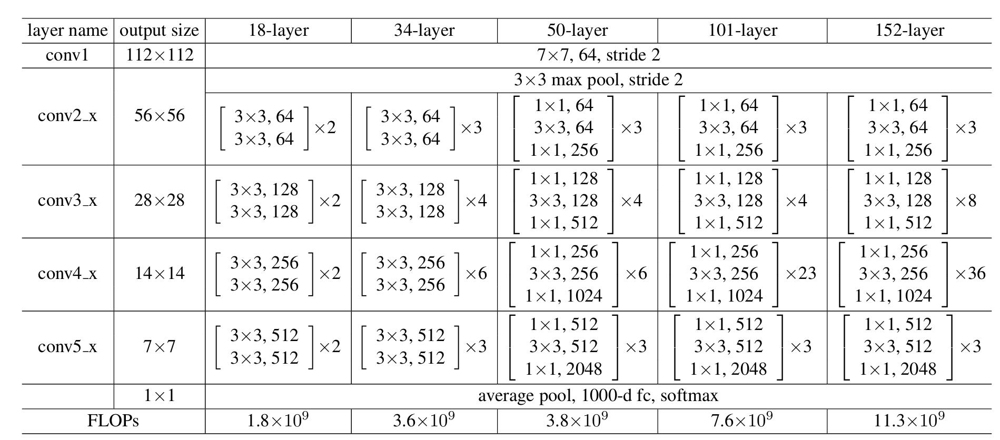
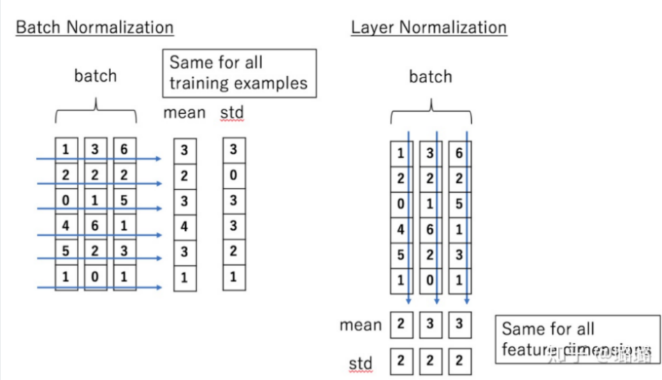

# 自然语言处理

<hr style="height:2px;border-width:0;color:red;background-color:red">


# <span style='color:red'>【一】 Seq2Seq翻译项目</span>

项目来源：[Chatbot Tutorial — PyTorch Tutorials 2.11.0+cu130 documentation](https://docs.pytorch.org/tutorials/beginner/chatbot_tutorial.html#seq2seq-model)

论文链接：[ Sequence to Sequence Learning with Neural Networks_Ilya Sutskever, Oriol Vinyals, Quoc V. Le](https://arxiv.org/abs/1409.3215)

数据集来源：[Tab-delimited Bilingual Sentence Pairs from the Tatoeba Project (Good for Anki and Similar Flashcard Applications)](https://www.manythings.org/anki/)

---

虽然传统的循环神经网络（如 RNN、LSTM）能够处理序列数据，但在处理长序列时，经常会遇到**梯度消失**或**梯度爆炸**的问题，导致模型难以捕捉长距离的依赖关系 。

深度神经网络（DNN）虽然强大，但它们的局限性在于无法直接处理输入和输出长度未知且可变的序列任务（如机器翻译、语音识别等）

## 1 核心架构：Seq2Seq 模型（Sequence to Sequence）

Seq2Seq 的核心思想是**将一个变长的输入序列映射为一个变长的输出序列**。

它由两部分组成：**编码器（Encoder）**和**解码器（Decoder）** 。

- **编码器 (Encoder)**：

    - **作用**：将输入序列（如一句英文）逐个词读入，最后压缩成一个固定维度的向量，这个向量被称为**上下文向量 (Context Vector)** 或 **隐藏状态 (S)** 。
    - **实现**：通常使用循环神经网络（RNN、LSTM 或 GRU） 。
    - 最终时刻的隐藏状态，被传递给解码器，作为解码器生成目标序列的基础信息

- **解码器 (Decoder)**：

    - **作用**：以编码器输出的上下文向量作为初始状态，逐个预测并生成目标序列（如对应的一句西班牙语） 。

    - **特点**：每一步的输出会作为下一步的输入，直到生成结束标记<EOS>或达到 max_length 。

    - 逐词生成输出：

        推理时以**自回归方式(autoregressive)**生成目标序列：

        - 每一步根据当前输入词 + 之前的隐藏状态预测下一个词
        - 把预测出的词作为下一步的输入
        
        > 训练时不用自回归，训练时我们知道所有tag的值，所以每一次**直接将正确的tag值作为输入**，而不使用前一时间步的预测值

> 编码器（Encoder）和解码器（Decoder）概念正是这篇论文**首次提出**的
>
> 在此前的模型输入和输出都只能是等长



## 2 关键改进：Attention 注意力机制

传统的 Seq2Seq 模型存在**信息瓶颈**：无论输入序列多长，都被压缩成一个固定长度的向量。这会导致长句子的信息在传递过程中被“稀释”，难以捕捉长距离依赖。

**Attention 注意力机制**解决了这个问题 ：

- **优势：**
    - **动态关注（动态权重分配）**：Attention 注意力允许模型在每个解码步骤动态选择输入序列的不同部分，从而更灵活地处理长序列。
    - **解决信息丢失问题**：通过引入注意力机制，模型不再依赖于单一的固定长度上下文向量，而是能够根据当前需求访问输入序列的所有信息。
    - **可解释性**：注意力权重提供了模型决策的可解释性，使得我们可以直观地看到模型在每个解码步骤时关注了输入序列的哪些部分。

- **工作原理**：解码器不再只依赖最后的固定向量，而是在在生成每个输出时，直接 “回看” 输入序列中的所有单词，并根据相关性给它们分配不同的权重 。

---

理解 Attention 最专业的方式是将其类比为**信息检索**过程。它涉及三个向量：

- **Query (查询 - Q)**：你当前正在关注的东西（比如你想翻译的当前单词）。
- **Key (键 - K)**：输入序列中所有信息的索引/标签（用来和你当前的 Q 匹配）。
- **Value (值 - V)**：输入序列中包含的实际内容。

**计算步骤：**

1. **相似度计算 (Score)**：计算 $Q$ 与每一个 $K$ 的点积，衡量它们之间的相关性。
2. **归一化 (Softmax)**：将这些分数通过 Softmax 函数转换为概率分布（即权重，总和为 1）。
3. **加权求和 (Weighted Sum)**：用这些权重乘以对应的 $V$，得到最终的注意力输出。

数学表达式为（以缩放点积注意力为例）：

$$\text{Attention}(Q, K, V) = \text{softmax}\left(\frac{QK^T}{\sqrt{d_k}}\right)V$$

> #### 自注意力 (Self-Attention)
>
> 这是目前最火的 **Transformer** 模型的核心。它与普通 Attention 的区别在于：$Q$、$K$、$V$ 全部来自于同一个输入序列。
>
> **作用**：它能让模型理解句子内部的结构。例如在句子“机器人坏了，因为它没电了”中，Self-Attention 能让模型通过计算，发现“它”和“机器人”之间的强关联。

### 2.1 模型中的注意力公式运算（Bahdanau注意力）

首先我们会得到一个**score**（注意力所需要的一个分数），score计算有下面两种方式：

- **Bahdanau注意力方式（本项目中使用）：**

    ==`score = FC(tanh(FC(EO) + FC(H)))`==

    缩写含义：

    - `EO`(encoder_outputs)：encoder 各个位置的输出（`keys`）
    - `H`(hidden_state)：decoder 某一步的隐含状态（`query`）
    - `FC`：全连接层

    > 论文中对各层FC的起名：`FC(EO)`的`FC`是`Wk`，`FC(H)`的`FC`是`Wq`，最外面的`FC`是`Wv` 

    这里用 tanh 激活函数，输出有正有负，会让梯度更新的比较快，不像sigmiod只有正值

    - score 是和 EO 长度一样的向量

    - tanh是激活函数

- **luong注意力：**

    `score = EO*W*H`

让score进行接下来处理：

- 变为权重：==`attention_weights = softmax(score, axis = 1)`==
- ==`context_vector = sum(attention_weights * EO, axis = 1)`==
    - `EO`是矩阵（`values`）
    - `attention_weights`是向量 
    - `context_vector` 是向量
- 将 x 和 context 拼接在一起 ==`final_input = concat(context_vector , embed(x))`==




## 3  LSTM重要变体：GRU模型 (Gated Recurrent Unit)

项目中常使用 GRU 代替标准的 RNN 或 LSTM，作为 LSTM 的一个流行变体，GRU 在保持 LSTM 效果的同时简化了结构 ，它将细胞状态和隐藏状态混合为一个单一的隐藏状态，计算比标准 LSTM 更简单 ，在减少了参数量、加快了训练速度的情况下，效果与 LSTM 相近。



- **重置门 (Reset Gate, $r_t$)**：决定丢弃多少过去的信息 。
- **更新门 (Update Gate, $z_t$)**：决定保留多少当前时刻的新信息 。

return_state 如果为 False 就只返回了输出，如果为 True ，就会返回输出，还有状态

> GRU 的**参数量是 RNN 的三倍**
>
> LSTM 的参数量是 RNN 的四倍

## 4 Mask（掩码）

在深度学习和自然语言处理（NLP）中，**Mask（掩码）** 的核心作用是**“隐藏”**某些信息，防止模型在训练或推理时看到不该看的数据。

你可以把它想象成考试时遮住答案的挡板，或者是在处理变长句子时用来填补空白的“胶带”。

### 4.1 填充掩码 (Padding Mask)

这是最常见的一种。由于深度学习模型通常需要输入固定形状的张量（Tensor），但实际句子的长度不一，我们会用特殊的 `[PAD]` 符号补齐。

- **目的**：告诉模型哪些位置是无意义的填充，不应该参与注意力计算。
- **操作**：在计算注意力权重（Attention Weights）时，将填充位置的值设为一个极小的负数（如 $-10^{9}$），经过 Softmax 后，这些位置的权重几乎变为 0，从而在计算加权和时被完全忽略。

#### 4.1.1 核心原理与张量操作

假设我们有一个 batch 的序列，长度不等，填充后的 mask 通常是一个布尔矩阵：

- `True` 或 `1`：表示该位置是**填充位**（需要被遮盖）。
- `False` 或 `0`：表示该位置是**真实数据**。

#### 4.1.2 PyTorch 代码示例

以下是一个简化版的 Transformer Attention 机制中应用 Mask 的过程：

```python
import torch
import torch.nn.functional as F

# 1. 模拟输入数据
# 假设 batch_size=2, seq_len=4
# 句子1长度为4，句子2长度为2（后两个是 padding）
src_tokens = torch.tensor([
    [10, 20, 30, 40],
    [50, 60, 0, 0]    # 0 是 padding token
])

# 2. 生成 Padding Mask (形状: batch_size, 1, 1, seq_len)
# 这里的 mask 标记哪些位置是 0 (Padding)
padding_mask = (src_tokens == 0).unsqueeze(1).unsqueeze(2) 
# 结果: [[[[False, False, False, False]]], [[[False, False, True, True]]]]

# 3. 模拟注意力得分 (Score = Q @ K.T)
# 假设得分矩阵形状为 (batch_size, num_heads, seq_len, seq_len)
scores = torch.randn(2, 1, 4, 4)

# 4. 应用 Mask
# 将 padding 位置替换为极小值（如 -1e9）
masked_scores = scores.masked_fill(padding_mask, -1e9)

# 5. 计算 Softmax 得到最终权重
attention_weights = F.softmax(masked_scores, dim=-1)

print("原始得分示例 (句子2最后一行):\n", scores[1, 0, -1])
print("掩码后权重 (句子2最后一行):\n", attention_weights[1, 0, -1])
```

运行结果:

`原始得分示例 (句子2最后一行):
 tensor([-0.2627, -0.1800,  0.6962, -0.4865])
掩码后权重 (句子2最后一行):
 tensor([0.4793, 0.5207, 0.0000, 0.0000])`

#### 4.1.3 在 PyTorch 内置模块中的使用

如果你使用 PyTorch 官方提供的 `nn.MultiheadAttention`，操作会更简单。它接受一个 `key_padding_mask` 参数：

```python
import torch.nn as nn

# 定义注意力层
multihead_attn = nn.MultiheadAttention(embed_dim=128, num_heads=8, batch_first=True)

# 准备数据
x = torch.randn(2, 4, 128) # (batch, seq_len, embed_dim)

# 这里的 mask 形状应为 (batch, seq_len)
# True 表示该位置是 padding，会被忽略
key_padding_mask = torch.tensor([
    [False, False, False, False],
    [False, False, True, True]
])

# 转发
attn_output, attn_weights = multihead_attn(x, x, x, key_padding_mask=key_padding_mask)
```

> ### 注意事项
>
> 1. **极小值的选择**：通常使用 `-1e9` 或 `float('-inf')`。如果使用 `float('-inf')`，在某些 FP16 半精度训练中可能会导致溢出（NaN），所以 `-1e4` 到 `-1e9` 之间通常更安全。
> 2. **维度对齐**：在手动实现 Transformer 时，Mask 的形状需要与 `(Q @ K^T)` 得到的得分矩阵通过广播机制（Broadcasting）对齐。

------

### 4.2 因果掩码 / 序列掩码 (Causal Mask / Look-ahead Mask)

常用于 **GPT** 等生成式模型（Decoder-only 架构）。

- **目的**：防止模型在预测当前词时“偷看”未来的词。例如，在预测第 $t$ 个词时，模型只能看到前 $t-1$ 个词。

- **形状**：通常是一个下三角矩阵。对角线以上（未来信息）全部被掩盖。

- **数学表示**：对于注意力得分矩阵 $S$，应用掩码 $M$：

    $$Attention(Q, K, V) = \text{softmax}\left(\frac{QK^T}{\sqrt{d_k}} + M\right)V$$

    其中 $M$ 中需要遮盖的位置为 $-\infty$。

------

### 4.3 任务特定掩码 (Task-specific Mask)

- **MLM (Masked Language Model)**：如 **BERT**。在预训练阶段，随机将句子中 15% 的词替换为 `[MASK]`，强迫模型根据上下文去“猜”这个词。
- **目的**：训练模型理解双向语境的能力。

------

**总结对比**

| **类型**         | **应用场景**             | **主要目的**               |
| ---------------- | ------------------------ | -------------------------- |
| **Padding Mask** | 所有 Transformer 模型    | 忽略变长序列中的填充位     |
| **Causal Mask**  | GPT, Transformer Decoder | 确保单向生成，防止偷看未来 |
| **MLM Mask**     | BERT, RoBERTa            | 预训练时的完形填空任务     |

## 5 带掩码（Masking）的交叉熵损失函数

```python
def cross_entropy_with_padding(logits, labels, padding_mask=None):
    # logits.shape = [batch size, sequence length, num of classes]
    # labels.shape = [batch size, sequence length]
    # padding_mask.shape = [batch size, sequence length] decoder_labels_mask
    bs, seq_len, nc = logits.shape
    loss = F.cross_entropy(logits.reshape(bs * seq_len, nc), labels.reshape(-1), reduction='none') #reduction='none'表示不对batch求平均
    if padding_mask is None:#如果没有padding_mask，就直接求平均
        loss = loss.mean()
    else:
        # 如果提供了 padding_mask，则将padding填充部分的损失去除后计算有效损失的均值。首先，通过将 padding_mask reshape 成一维张量，并取 1 减去得到填充掩码。这样填充部分的掩码值变为 1，非填充部分变为 0。将损失张量与填充掩码相乘，这样填充部分的损失就会变为 0。然后，计算非填充部分的损失和（sum）以及非填充部分的掩码数量（sum）作为有效损失的均值计算。(因为上面我们设计的mask的token是0，所以这里是1-padding_mask)
        padding_mask = 1 - padding_mask.reshape(-1) #将padding_mask reshape成一维张量，mask部分为0，非mask部分为1
        loss = torch.mul(loss, padding_mask).sum() / padding_mask.sum()

    return loss
```

这段代码实现了一个**带掩码（Masking）的交叉熵损失函数**。在 NLP 任务（如机器翻译或文本生成）中，由于每个句子的长度不同，我们会用 `PAD` 符号将它们补齐到相同长度。

**这段代码的核心目的**是：在计算损失（Loss）时，**只计算真实单词的损失，忽略掉那些为了对齐而填充的 `PAD` 符号。**

### 5.1 核心步骤拆解

**第一步：形状展平 (Flattening)**

```Python
loss = F.cross_entropy(logits.reshape(bs * seq_len, nc), labels.reshape(-1), reduction='none')
```

- `F.cross_entropy` 通常期望输入是二维的（样本数, 类别数）。
- 代码将 `[batch size, sequence length, num of classes]` 展平为 `[batch * sequence, num of classes]`。
- **关键点**：`reduction='none'`。这告诉 PyTorch 不要立刻计算平均值，而是返回一个**每个单词对应一个损失值**的向量（长度为 `bs * seq_len`）。

---

**第二步：处理 Padding Mask**

代码中的逻辑稍微有点绕，因为它根据你传入的 `padding_mask` 定义做了调整：

```Python
padding_mask = 1 - padding_mask.reshape(-1)
```

- **假设**：你原始的 `padding_mask` 中，`1` 表示 `PAD`（要遮盖），`0` 表示真实单词。
- **变换后**：新的 `padding_mask` 中，`0` 表示 `PAD`，`1` 表示真实单词。
- 这样做的目的是为了后续做**点乘**。

> **代码中的一个小细节**
>
> 你在注释里写到：
>
> > 因为上面我们设计的mask的token是0，所以这里是1-padding_mask
>
> 这说明你的原始 `padding_mask` 里 **0 代表有效，1 代表 PAD**。
>
> - 如果你的 `padding_mask` 已经是 **1 代表有效，0 代表 PAD**（这是 PyTorch 常见的另一种约定），那么你就不需要执行 `1 - padding_mask` 这一步了。

---

**第三步：加权求和与去偏平均**

```Python
loss = torch.mul(loss, padding_mask).sum() / padding_mask.sum()
```

这是计算“有效均值”的标准做法：

1. **`torch.mul(loss, padding_mask)`**：将 `PAD` 位置的损失全部乘以 0（抹除），真实单词的损失乘以 1（保留）。
2. **`.sum()`**：把所有真实单词的损失加起来。
3. **`/ padding_mask.sum()`**：除以真实单词的总数，而不是整个矩阵的大小。

### 5.2 为什么要这么做？（举个例子）

假设 Batch Size 为 1，句子最大长度为 5，但实际只有 3 个词：

- **标签**: `[我, 爱, 你, PAD, PAD]`
- **模型预测损失**: `[0.5, 0.1, 0.2, 4.5, 5.2]` （最后两个是模型对 `PAD` 的瞎猜，损失通常很高）

1. **如果不加 Mask**：平均损失为 $(0.5+0.1+0.2+4.5+5.2) / 5 = 2.1$。模型会花大力气去学习如何预测 `PAD`，这毫无意义。
2. **如果加了 Mask**：`padding_mask` 为 `[1, 1, 1, 0, 0]`。
    - 有效损失之和：$0.5+0.1+0.2 = 0.8$
    - 有效单词数：$1+1+1 = 3$
    - **最终损失**：$0.8 / 3 = 0.267$。

这样模型就只会专注于学习如何预测“我爱你”。

## 6 choice() 从给定的序列中随机抽取元素

### 6.1 `random.choice()` (Python 标准库)

这是最基础的用法，适用于从列表、元组或字符串中随机选择**单个**元素。

- **功能**：从非空序列中随机返回一个元素。
- **语法**：`random.choice(seq)`
- **特点**：简单快捷，但一次只能取一个值。

**代码示例：**

```Python
import random
fruits = ['苹果', '香蕉', '樱桃']
print(random.choice(fruits)) # 随机输出其中一个
```

### 6.2 `numpy.random.choice()` (NumPy 库)

这是数据科学和机器学习中最常用的版本，功能极其强大，支持批量抽取和概率设置。

**核心参数说明：**

- **a**: 抽取的样本范围（可以是一个数组，也可以是一个整数，若为整数 $n$ 则表示从 `np.arange(n)` 中抽取）。
- **size**: 输出的形状（例如 `size=5` 表示抽取 5 个，`size=(2,3)` 表示输出一个 2x3 的矩阵）。
- **replace**: 是否为**有放回抽样**。
    - `True`（默认值）：同一个元素可以被抽取多次。
    - `False`：同一个元素最多只能被抽取一次（无放回抽样）。
- **p**: 与样本范围一一对应的**概率数组**。如果不设置，则每个元素被抽到的概率相等。

**代码示例：**

```Python
import numpy as np

# 场景：从 [0,1,2,3] 中有放回地随机抽取 5 个数
res1 = np.random.choice(5, size=5, replace=True)

# 场景：设置不均匀概率抽取
# 抽到 'A' 的概率为 0.1，抽到 'B' 的概率为 0.9
options = ['A', 'B']
res2 = np.random.choice(options, size=10, p=[0.1, 0.9])
print(res2)
```

------

**两者的主要区别**

| **特性**     | **random.choice**     | **numpy.random.choice**          |
| ------------ | --------------------- | -------------------------------- |
| **抽取数量** | 只能抽取 1 个         | 可批量抽取（通过 `size`）        |
| **概率控制** | 不支持直接设置权重    | 支持（通过 `p` 参数）            |
| **抽样方式** | 必须有放回            | 可选有放回或无放回（`replace`）  |
| **适用对象** | 普通 Python 列表/序列 | NumPy 数组，性能更适合大规模计算 |

## 7 @property 装饰器

在 Python 中，`@property` 是一个内置的**装饰器**，它的核心作用是**将一个方法伪装成属性**。

这样做的好处是：你可以在保持属性访问语法（如 `obj.score`）的同时，在后台执行逻辑控制（如参数校验、计算等）。

**为什么需要它？**

假设你有一个类，记录学生的成绩。如果直接暴露属性，用户可能会赋一些不合理的值：

```Python
class Student:
    def __init__(self, score):
        self.score = score

s = Student(90)
s.score = 9999  # 显然这不合理，但无法阻止
```

**使用 `@property` 的标准写法**

通过 `@property`，我们可以把 `score` 变成“私有化”管理，并提供专门的访问和修改接口：

```Python
class Student:
    def __init__(self, score):
        self._score = score  # 注意：这里习惯用下划线开头表示私有

    @property
    def score(self):
        """getter：获取属性值"""
        print("正在获取成绩...")
        return self._score

    @score.setter
    def score(self, value):
        """setter：设置属性值，并增加逻辑判断"""
        if not isinstance(value, int):
            raise ValueError("成绩必须是整数！")
        if value < 0 or value > 100:
            raise ValueError("成绩必须在 0-100 之间！")
        print("正在设置成绩...")
        self._score = value
```

**`@property` 的三大功能**

| **功能**    | **语法糖**       | **作用**                                                    |
| ----------- | ---------------- | ----------------------------------------------------------- |
| **Getter**  | `@property`      | 当你执行 `obj.score` 时触发。用于返回属性值。               |
| **Setter**  | `@score.setter`  | 当你执行 `obj.score = 80` 时触发。用于**校验**或修改数据。  |
| **Deleter** | `@score.deleter` | 当你执行 `del obj.score` 时触发。用于删除属性前的清理工作。 |

**核心优势**

- **兼容性**：如果一开始你直接使用了属性，后来想增加验证逻辑，使用 `@property` 可以不改变外部调用者的代码。
- **只读属性**：如果你只定义了 `@property` 而没有定义 `@setter`，那么这个属性就是**只读**的。
- **数据封装**：隐藏内部实现细节。例如，你可以定义一个 `age` 属性，但内部逻辑是根据 `birth_year` 实时计算出来的。

---

**总结**

> **`@property` 让你的类接口看起来简洁（像属性），但内部逻辑严谨（像方法）。**

## 8 问题记录

热力图显示错位

```python
translator = Translator(model.cpu(), src_tokenizer, trg_tokenizer)
translator('私はリンゴを食べました。')
```



**问题出现在绘图函数中:**

```python
def draw_attention_map(self, scores, src_words_list, trg_words_list):
    """
    绘制注意力热力图

    Args:
        - scores (numpy.ndarray): shape = [source sequence length, target sequence length]
    """
    # print(scores.shape)  # （pred_seq_len,input_seq_len)
    #scores.T转置后，变为（pred_seq_len,input_seq_len)
    plt.matshow(scores.T, cmap='viridis') # 注意力矩阵,显示注意力分数值

    # 获取当前的轴
    ax = plt.gca()

    # 设置热图中每个单元格的分数的文本
    for i in range(scores.shape[0]): #输入
        for j in range(scores.shape[1]): #输出
            ax.text(j, i, f'{scores[i, j]:.2f}',  # 格式化数字显示
                           ha='center', va='center', color='k')

    plt.xticks(range(scores.shape[0]), src_words_list)
    plt.yticks(range(scores.shape[1]), trg_words_list)
    plt.show()
```

调用传值：
```python
# 绘制注意力热力图
self.draw_attention_map(
    scores.squeeze(0).numpy(),
    src_decoded,  # 注意力图的源句子,文本列表
    trg_sentence  # 注意力图的目标句子，文本列表
    )
```

### scores.shape分析

**1. Decoder 中的维度**

在 `BahdanauAttention` 类中：

- **输入**：`keys`（即 Encoder 的输出）的形状是 `[batch size, source_seq_len, hidden_dim]`。
- **计算**：通过 `self.V(F.tanh(Wk(keys) + Wq(query)))` 计算出的 `scores` 形状确实是 **`[batch size, source_seq_len, 1]`**。
- 这里的 `source_seq_len` 代表源语言（日语）句子的长度。

**2. Model 拼接后的维度**

在 `Sequence2Sequence.forward` 中：

- 循环次数由 `decoder_inputs` 的长度决定，即 `target_seq_len`。
- 每次循环产生的 `score` 形状为 `[batch size, source_seq_len, 1]`。
- **拼接操作**：`torch.cat(scores_list, dim=-1)` 在最后一个维度上进行拼接。
- **结果**：拼接后的形状变为 **`[batch size, source_seq_len, target_seq_len]`**。

**3. Infer 中的维度**

在 `Sequence2Sequence.infer` 中：

- 由于是单句推理，`batch_size` 被固定为 1。
- 拼接逻辑与 `forward` 一致。
- **结果**：返回的 `scores.shape` 确实是 **`[1, source_seq_len, target_seq_len]`**。

**4. draw_attention_map 中的维度**

 传入`draw_attention_map` 函数时进行了`scores.squeeze(0).numpy()` 

于是`draw_attention_map` 函数会得到一个二维矩阵，形状为 `(source_seq_len, target_seq_len)`。

#### 问题根源：

1. **绘图逻辑**：
    - 矩阵的 **行 (Row)** 对应 **源语言 (Source)**。
    - 矩阵的 **列 (Column)** 对应 **目标语言 (Target)**。
2. **转置操作**：在绘图时使用了 `scores.T`，矩阵变为 `(target_seq_len, source_seq_len)`，此时行对应英语，列对应日语。

```python
#scores.T转置后，变为（pred_seq_len,input_seq_len)
plt.matshow(scores.T, cmap='viridis')
```

3. 在后续填充每个单元格的分数文本时使用的是未转置的 `score`  shape为`(source_seq_len, target_seq_len)`

    此处将 `target_seq_len`轴的下标传给了 x 轴， `source_seq_len` 轴的下标传给了 y 轴（与底图相反）

    这导致数值填充时的索引与底图的词汇完全对不上

```python
# 设置热图中每个单元格的分数的文本
for i in range(scores.shape[0]): #输入
    for j in range(scores.shape[1]): #输出
        ax.text(j, i, f'{scores[i, j]:.2f}',  # 格式化数字显示
                       ha='center', va='center', color='k')
```

> **`ax.text(x, y, text)` 的逻辑**：第一个参数 `x` 是横坐标（列索引），第二个参数 `y` 是纵坐标（行索引）。

**修正：将此处的 i 与 j 交换**

```python
# 设置热图中每个单元格的分数的文本
for i in range(scores.shape[0]): #输入
    for j in range(scores.shape[1]): #输出
        ax.text(i, j, f'{scores[i, j]:.2f}',  # 格式化数字显示
                       ha='center', va='center', color='k')
```

修正后热力图：



## 9 热力图（Heatmap）

**1. 基本定义** 热力图是一种通过**颜色深浅**来展示数值大小的直观可视化图表。它通常是一个矩阵（表格），每一个单元格对应一个数值，而这个数值被映射为某种颜色。

**2. 核心要素：颜色映射 (Color Map)**

- **深色/亮色**：通常代表较大的数值（在注意力机制中，代表“关注度”高）。
- **浅色/暗色**：通常代表较小的数值（代表“关注度”低）。
-  `viridis` 配色方案，通常黄色代表高分（接近1.0），深紫色代表低分（接近0）。

**3. 怎么看热力图？**

- **看坐标轴**：确定横轴（X轴）和纵轴（Y轴）分别代表什么含义。
- **看交汇点**：找到横纵轴交汇的单元格，观察其颜色。
- **寻找模式**：比如是否存在一条对角线（代表一一对应的翻译），或者某个词在多个词上都有很深的颜色（代表这个词是句子的核心）。

**4. 为什么要看这张图？**

1. **可解释性**：深度学习常被说是“黑箱”，但注意力热力图让我们看到了模型翻译时的“心路历程”——它在想这个词的时候到底在看哪儿。
2. **纠错**：如果翻译错了（比如把“猫”翻译成了“狗”），通过热力图你可以发现，是因为模型在生成“狗”时，错误地关注到了源句中其他的词。
3. **验证模型质量**：训练良好的模型，其热力图应该是“干净”的（权重集中在少数几个相关的词上）；如果整张图颜色都很乱、很平均，说明模型根本没有学会如何对齐词汇。

## 10 BLEU (Bilingual Evaluation Understudy)评估指标

自然语言处理（NLP）中评估机器翻译质量最常用的指标之一。

核心思想是：**机器翻译越接近人工翻译，质量就越高。**

BLEU 通过计算机器翻译（Candidate）与参考翻译（Reference）之间的 **n-gram 重合度**来打分。

- **Precision-based**: 它本质上是一种精确率（Precision）的变体。
- **n-gram**: 连续的 $n$ 个词集合。例如 "I love AI"，其 1-gram 为 {"I", "love", "AI"}，2-gram 为 {"I love", "love AI"}。
- **优点**: 计算速度快、成本低，且与人类评分具有较强的相关性。

---

BLEU 的得分由两部分组成：**修正的多元精度（Modified n-gram Precision）** 和 **短句惩罚因子（Brevity Penalty）**。

取值范围在 **0 到 1** 之间（在论文和实际报告中，通常会乘以 100，表示为 **0 到 100**）。

- **0**: 表示机器翻译与参考翻译完全没有重合（甚至连一个词都没对上），或者翻译极短触发了严厉的惩罚。
- **1 (或 100)**: 表示机器翻译与参考翻译**完全一致**。

### 10.1 截断匹配数

是 BLEU 算法中为了解决“模型作弊”而引入的核心机制。

简单来说，它的目的是：**防止机器翻译通过不断重复同一个正确单词来获得虚高分。**

**1. 为什么需要“截断”？（痛点）**

假设我们有一个非常糟糕的翻译模型，它只学会了单词 "the"。

- **参考译文 (Reference):** `The cat is on the mat.` (其中 "the" 出现了 **2** 次)
- **机器翻译 (Candidate):** `the the the the the the the` (其中 "the" 出现了 **7** 次)

**如果不截断（传统精确率）：**

机器翻译中的 7 个 "the" 都在参考译文中找到了。

$Precision = \frac{7}{7} = 1.0$ (满分！这显然是不合理的)。

**2. 截断匹配的规则**

为了修正这个问题，BLEU 规定：一个词在译文中被计算为“匹配”的次数，**不能超过**它在任何一个参考译文中出现的**最大次数**。

公式表达为：

$$Count_{clip} = \min(Count_{candidate}, Max\_RefCount)$$

- **$Count_{candidate}$**: 该词在机器翻译中出现的次数。
- **$Max\_RefCount$**: 该词在单句参考译文中出现的最多次数。

### 10.2 修正的多元精度 ($P_n$)

为了防止机器翻译通过重复高频词（如 "the the the"）来刷分，BLEU 限制了每个词的匹配次数不能超过它在参考译文中出现的最高次数。
$$
P_n = \frac{\sum_{C \in \{Candidates\}} \sum_{n\text{-gram} \in C} Count_{clip}(n\text{-gram})}{\sum_{C' \in \{Candidates\}} \sum_{n\text{-gram}' \in C'} Count(n\text{-gram}')}
$$


### 10.3 短句惩罚因子 (BP)

如果翻译过短，重合度往往会异常高。BP 因子用于**惩罚那些过短的译文**：

$$BP = \begin{cases} 1 & \text{if } c > r \\ e^{(1-r/c)} & \text{if } c \le r \end{cases}$$

其中 $c$ 是译文长度，$r$ 是参考译文长度。

### 10.4 最终公式

通常取 $n=1, 2, 3, 4$，并计算其几何平均值：
$$
BLEU = BP \cdot \exp\left(\sum_{n=1}^{N} w_n \log P_n\right)
$$
通常设置权重 $w_n = 1/N$。

---

### 10.5 计算示例

#### 核心逻辑：n-gram 匹配与截断（Clipping）

BLEU 的核心是 **“修正的精度”**。如果一个词在译文中出现 5 次，但在参考译文中最多只出现 2 次，那么它的匹配数只能计为 2，这防止了模型通过重复常用词来作弊。

------

#### 场景设定

- **Candidate (机器翻译):** `the the the cat` (长度 $c=4$)
- **Reference 1:** `the cat is on the mat` (长度 $r_1=6$)
- **Reference 2:** `the cat is here` (长度 $r_2=4$)

------

#### 1-gram 计算 (Individual Unigram)

1-gram 主要衡量**词汇选择**的准确性。

1. **拆解 Candidate 的 1-grams:** `{"the": 3, "cat": 1}`

2. **计算在 Reference 中的最大出现次数 ($Count_{max}$):**

    - `the`: 在 Ref1 出现 2 次，在 Ref2 出现 1 次。$Count_{max} = 2$。
    - `cat`: 在 Ref1 出现 1 次，在 Ref2 出现 1 次。$Count_{max} = 1$。

3. **计算截断匹配数 ($Count_{clip}$):**

    - `the`: $min(3, 2) = 2$
    - `cat`: $min(1, 1) = 1$

4. **$P_1$ 结果:**

    $$P_1 = \frac{2 + 1}{4} = 0.75$$

------

#### 2-gram 计算 (Individual Bigram)

2-gram 主要衡量**相邻词的流畅度**。

1. **拆解 Candidate 的 2-grams:** `{"the the": 2, "the cat": 1}`

2. **计算 $Count_{max}$:**

    - `the the`: Ref1 中没有连续两个 the，Ref2 也没有。$Count_{max} = 0$。
    - `the cat`: Ref1 中有 1 次，Ref2 中有 1 次。$Count_{max} = 1$。

3. **计算 $Count_{clip}$:**

    - `the the`: $min(2, 0) = 0$
    - `the cat`: $min(1, 1) = 1$

4. **$P_2$ 结果:**

    $$P_2 = \frac{0 + 1}{3} \approx 0.33$$

------

#### 综合计算：BLEU-2 分数

假设我们要计算 BLEU-2（即只考虑 1-gram 和 2-gram），步骤如下：

**Step 1: 计算短句惩罚 (BP)**

- 译文长度 $c = 4$。
- 最近的参考长度 $r = 4$ (取 Ref2)。
- 因为 $c \ge r$，所以 $BP = 1$。

**Step 2: 几何平均**

假设权重均等 ($w_1=0.5, w_2=0.5$)：

$$Score = 1 \times \exp(0.5 \times \ln(0.75) + 0.5 \times \ln(0.33))$$

$$Score \approx \sqrt{0.75 \times 0.33} \approx 0.497$$

**Step 3: 最终得分 (论文格式)**

$$BLEU = 0.497 \times 100 = 49.7$$

> 在学术论文中，BLEU 的原始取值范围是 $[0, 1]$。为了方便阅读和对比，作者通常将其**乘以 100**。
>
> - 例如，BLEU 得分为 **25.4** 实际上代表 **0.254**。
> - 这种表示法更直观，能更清晰地展现出 0.1 级别的细微改进。

> ### 总结
>
> - **1-gram** 高：说明单词找得准。
> - **4-gram** 高：说明句式非常地道、流畅。
> - **如果 $P_n$ 为 0**：会导致最终结果变成 0，这就是为什么在处理短句或小样本时，`nltk` 的 `SmoothingFunction` 至关重要。

------

### 10.6 在 NLTK 库中的使用

Python 的 `nltk` 库提供了非常便捷的接口。注意：`references` 必须是一个**列表的列表**，因为一个译文可以对应多个参考翻译。

基本语法：==`entence_bleu(references, candidate, weights=(0.25, 0.25, 0.25, 0.25), smoothing_function=None)`==

参数：

- `references` ：参考译文列表（二维列表）
- `candidate`：待评价译文（三维列表）
- `weights` ：权重元组
- `smoothing_function` ：平滑函数。对于短句子，如果某个高阶 n-gram 匹配为 0，整个 BLEU 分数会直接变成 0。平滑函数可以**给 0 匹配一个极小的增量**。

```Python
from nltk.translate.bleu_score import sentence_bleu

# 参考翻译（可能有多个）
reference = [['the', 'quick', 'brown', 'fox', 'jumps', 'over', 'the', 'lazy', 'dog']]
# 机器翻译
candidate = ['the', 'fast', 'brown', 'fox', 'leap', 'over', 'the', 'lazy', 'dog']

# 1. 计算单个句子的 BLEU
# 默认权重是 (0.25, 0.25, 0.25, 0.25)，即 BLEU-4
score = sentence_bleu(reference, candidate)
print(f"BLEU Score: {score * 100:.2f}")

# 2. 指定计算 BLEU-1 (weights 只给第一阶)
score_1gram = sentence_bleu(reference, candidate, weights=(1, 0, 0, 0))
print(f"BLEU-1: {score_1gram:.2f}")
```

# 

<hr style="height:2px;border-width:0;color:red;background-color:red">

# <span style='color:red'>【二】 Transformer翻译项目</span>

论文链接：[ Attention Is All You Need](https://arxiv.org/abs/1706.03762)

**Transformer 提出的背景：**

| 背景因素                          | 说明                                                         |
| --------------------------------- | ------------------------------------------------------------ |
| **RNN/LSTM 的缺陷**               | **无法并行计算**、**长距离依赖问题**、**难以捕捉全局信息**   |
| **注意力机制（Attention）的启发** | 注意力能帮助模型关注输入的重要部分，但早期 **与 RNN 结合使用**并没有完全脱离 RNN 的框架 |
| **追求更高效的架构**              | 希望有一种能完全并行、高效捕捉全局依赖的模型                 |
| **技术积累与突破**                | 当时硬件（如 GPU）和算法（如多头注意力）的发展为 Transformer 提供了可能 |

Google 的研究团队在《Attention is All You Need》中提出了 **Transformer 模型**，其核心创新在于：

**<span style='color:red'>完全抛弃了 RNN 和 CNN，仅依靠"自注意力机制（Self-Attention）"和"位置编码（Positional Encoding）"来处理序列数据。</span>**

Transformer 的主要特点包括：

**1. 自注意力机制（Self-Attention）** 允许模型在处理每个 token 时，直接关注输入序列中的所有其他 token，无论它们在序列中的位置如何。这大大增强了模型捕捉长距离依赖的能力，并且所有 token 的表示可以并行计算。

**2. 多头注意力（Multi-Head Attention）** 引入了多个注意力"头"，让模型可以从不同的表示子空间学习到多样化的信息。

**3. 位置编码（Positional Encoding）** 因为 Transformer 不再使用 RNN，没有了序列的时间顺序信息，所以需要通过人为构造的位置编码，将 token 在序列中的相对或绝对位置信息注入模型。

**4. 完全并行化** 由于没有循环结构，Transformer 的编码器部分可以对整个输入序列进行并行处理，极大提升了训练效率。

---

## 1 Transformer 模型结构

Transformer是一个完全基于注意力机制（Attention Mechanism）的序列到序列（Seq2Seq）模型，主要由**编码器（Encoder）**和**解码器（Decoder）**两部分组成。

- **并行处理优势**：与传统的RNN不同，Transformer的编码器允许序列中的所有词汇（如“I have a dream”）**同时输入**到模型中进行并行计算，极大提高了训练效率。
- **堆叠结构**：编码器和解码器分别由 $N$ 个相同的子层堆叠而成（在原始论文中 $N=6$）。

Transformer**模型（编码器-解码器结构）**架构图：



这个架构通过**自注意力**捕捉序列内的依赖，**交叉注意力**对齐输入输出，**残差连接+层归一化**稳定训练，**前馈网络**增强表达能力，是Transformer的核心设计。

### 1.1 输入/输出层

**Inputs (输入)**：模型的原始输入序列（如源语言句子），首先需要通过词表映射转换为离散的符号（Token）。

**Outputs (shifted right) (解码器输入)**：在自回归训练时，解码器的输入是“目标序列向右移一位”。这确保了在预测第 $i$ 个词时，模型只能看到前 $i-1$ 个词，避免“偷看”未来信息（信息泄露）。

### 1.2 嵌入与位置编码（Embedding + Positional Encoding）

- **Input/Output Embedding (嵌入层)**：将输入/输出的离散的词汇符号转换为固定维度的连续稠密向量（词向量），用于捕获词汇的基础语义信息。

- **位置编码 (Positional Encoding)**: 因为Transformer完全抛弃了RNN和CNN，其自注意力机制本身是**无序**的（无法感知词汇在句子中的位置）。为了解决这个问题，必须在词嵌入向量中加入**位置信息**。

    - **操作方式**：将 Input/Output Embedding 的输出与位置编码向量进行**按元素相加**（$\oplus$），作为后续网络的输入。

    - **生成方式**：通常使用不同频率的正弦和余弦函数来生成，公式如下（其中 $pos$ 是位置，$i$ 是维度，$d_{model}$ 是嵌入维度）：

        $$PE_{(pos, 2i)} = \sin(pos / 10000^{2i/d_{model}})$$

        $$PE_{(pos, 2i+1)} = \cos(pos / 10000^{2i/d_{model}})$$

        这种设计使得模型不仅能区分“不同位置的相同词”，还能让模型相对容易地学习到相对位置关系。

### 1.3 编码器(Encoder)（左侧，重复N次）

编码器的主要作用是提取输入序列的深度语义特征和上下文依赖。

核心是“**多头自注意力（Multi-Head Attention）**”和“**前馈神经网络（Feed Forward）**”，并通过“**残差连接+层归一化（Add & Norm）**”稳定训练。

- **Multi-Head Attention**: 将输入向量映射到多个不同的子空间（即分为多个“头”），**并行计算自注意力**，最后将结果拼接。这有助于模型从不同维度捕获序列内部的依赖关系。

    - **Q、K、V 的来源**：在自注意力中，查询（Query, $Q$）、键（Key, $K$）和值（Value, $V$）均来自于**同一个输入序列**（即上一层的输出经过三个不同的线性变换矩阵得到）。

        **注意力计算公式**（缩放点积注意力）：
        $$
        Attention(Q, K, V) = softmax(\frac{QK^T}{\sqrt{d_k}})V
        $$
        

        > 除以 $\sqrt{d_k}$ 是为了防止内积过大导致Softmax梯度消失。

- **残差连接与层归一化 (Add & Norm)**: 每个子层（注意力层和前馈层）之后都会接一个 `Add & Norm` 模块，用于稳定和加速深层网络的训练。

    - **Add (残差连接)**：$Output = Sublayer(x) + x$。将输入直接加到输出上，有效缓解深度神经网络中的梯度消失问题。
    - **Norm (层归一化 Layer Normalization)**：对每个样本在特征维度上进行均值和方差的归一化，而不是像Batch Norm那样在批次维度上做。

- **前馈神经网络 (Feed Forward)**:对每个位置的向量进行独立且相同的处理，增强模型的非线性表达能力。

    - 本质上是一个包含两个线性变换和一个非线性激活函数的两层全连接网络（**线性变换+激活函数+线性变换**）：
        $FFN(x) = \max(0, xW_1 + b_1)W_2 + b_2$（通常使用ReLU或GELU作为激活函数）。

- **Nx**: 编码器由N个这样的“**注意力+前馈**”子层堆叠而成（如Transformer论文中N=6）。

### 1.4 解码器 (Decoder)（右侧，重复N次）

解码器的任务是根据编码器提取的上下文信息和之前已经生成的词，预测下一个词。

解码器在编码器的基础上，多了一个“**掩码多头自注意力（Masked Multi-Head Attention）**”，并接收编码器的输出作为“交叉注意力”的输入。

- **掩码多头自注意力 (Masked Multi-Head Attention)**: 与编码器的自注意力类似，但增加了一个**掩码（Mask）**操作。
    - **作用**：在生成序列时，当前位置只能利用它左侧（之前）的已知信息。掩码会将未来位置的注意力权重强行置为 $-\infty$（经过Softmax后变为0），强制模型保持自回归特性。
- **Add & Norm**: 同编码器的**残差连接+层归一化**，稳定训练。
- **交互注意力 / 交叉注意力 (Encoder-Decoder Attention)**: 这是连接编码器和解码器的桥梁。
    - **Q、K、V 的特殊分配**：这里的 Query ($Q$) 来自于**解码器**的前一子层输出，而 Key ($K$) 和 Value ($V$) 均来自于**编码器的最终输出**。
    - **核心图解说明**：如附加说明图所示，**编码器最后一个Layer的输出，会同时输入到解码器的每一层中**参与交互注意力的计算。这使得解码器在生成每个词时，都能关注到输入序列中最相关的部分（例如翻译对齐）。
- **Add & Norm**: 残差连接+层归一化。
- **Feed Forward**: 同编码器的前馈神经网络。
- **Nx**: 解码器也由N个这样的子层堆叠而成。

### 1.5 输出层 (Linear + Softmax)

- **Linear (线性变换)**：将解码器最后输出的特征向量映射到一个维度极大的向量上，维度大小等于**目标词汇表的大小**（Vocabulary Size）。
- **Softmax**：将线性层的输出转换为一个概率分布，所有词汇的概率之和为1。概率最大（Argmax）对应的词，即为模型在该步预测出的最终结果。

### 1.6 整体流程（以机器翻译为例）

1. **输入处理**: 源语言句子通过 `Input Embedding` 和 `Positional Encoding`，输入编码器。
2. **编码器处理**: N层“注意力+前馈”子层处理输入，捕捉源语言的语义和结构，输出上下文向量。
3. **解码器处理**: 目标语言句子（右移后）通过 `Output Embedding` 和 `Positional Encoding`，先经过 `Masked Multi-Head Attention`（自回归），再通过 `Multi-Head Attention`（交叉注意力，关注编码器输出），最后通过 `Feed Forward`，得到输出向量。此过程重复 $N$ 次。
4. **输出预测**: 线性层+Softmax将输出向量转换为词汇表上的概率分布，生成翻译结果。

---

**附加说明：**这张图为了说明Encoder模块的输出，是如何和Decoder模块的每一层衔接的，同时我们的词，比如I have a dream是同时输入到模型中的。


## 2 ResNet (残差网络) 

它的核心贡献在于**彻底解决了深层神经网络无法有效训练的问题**，使得构建和训练拥有上百层甚至上千层的超深网络成为可能。

### 2.1 核心技术/机制：残差连接（Residual Connection）

残差连接（Residual Connection），有时也称为“跳跃连接”（Skip Connection），是深度神经网络（特别是诸如ResNet和Transformer等深层模型）中一项极其核心的架构创新。它的提出主要是为了解决网络在不断加深时所面临的**梯度消失/爆炸**和**网络退化**问题。

- **网络退化问题（Degradation Problem）**： 当我们在原有的网络模型上无脑叠加更多层数时，不仅测试集的错误率会升高，连**训练集的错误率也会升高**。

    

    造成这种现象的主要原因是，在反向传播过程中，误差梯度需要经过多次权重矩阵相乘和非线性激活函数的求导。网络越深，连乘的项越多，梯度在传回浅层时就越容易变得无限接近于0（梯度消失），导致浅层参数根本得不到有效更新；或者变得非常大（梯度爆炸），导致模型无法收敛。

### 2.2 模型结构：残差块 (Residual Block)


正如上方结构图中的那个跨越层的“弯曲箭头”所示，残差连接引入了一种**“短路机制”**（残差连接）。

- **传统的网络层**：试图直接学习输入 $x$ 到预期输出的一个复杂映射函数，记作 $H(x)$。

- **残差网络层**：不再让网络层生硬地去拟合 $H(x)$，而是让网络去拟合**残差（Residual）**，即目标输出与输入之间的差值：$F(x) = H(x) - x$。

- **最终的输出**：通过一条直接绕过特定层（通常是2到3个卷积层或全连接层）的连接，将原始输入 $x$ 强行“加”到这几层的输出上。最终的输出公式就变成了：
    $$
    y = F(x) + x
    $$

ResNet（残差网络）家族架构配置表：



> **FLOPs**：即浮点运算次数（Floating Point Operations）。这是衡量模型计算复杂度和所需算力资源的重要指标。可以看出，随着层数增加，计算量也随之显著提升。
>
> **残差块 (Residual Block)**：网络最基础的“砖块”或“房间”。它包含 2 或 3 个卷积层，并且内部自带一条短路机制（残差连接）。
>
> **残差层 (Residual Layer)**：由多个连续的“残差块”串联组成的一个大“楼层”或阶段。例如表格中的 `conv2_x` 整体就可以被称为 Layer 1，它内部包含了 3 个残差块。

### 2.3 ResNet 的核心创新点

1. **引入残差连接 (Residual Connection)**
    - **作用**：解决了深层神经网络在训练时容易出现的**梯度消失**和**梯度爆炸**问题。
    - **优势**：使得网络在学习过程中能保留更多的原始信息，从而让超深层网络的优化和训练变得更加容易。
2. **采用跨层连接 (Cross-layer Connection)**
    - **作用**：不仅在同一层引入残差，还在不同层之间使用跨层连接。
    - **优势**：使得网络能够设计得更深、更复杂，同时依然能有效地传递信息。
3. **采用批量归一化 (Batch Normalization)**
    - **作用**：对每一个小批量（Mini-batch）数据进行归一化处理。
    - **优势**：避免了网络训练过程中的梯度问题，加速了网络收敛，显著提高了网络的泛化能力和稳定性。
4. **网络结构较为简单**
    - **优势**：尽管使用了残差连接和跨层连接等前沿技术，但 ResNet 的整体网络宏观结构并不复杂。这使得它极易于代码实现和逻辑理解，并在各种计算机视觉任务中都表现出了卓越的性能。

### 2.4 常见的 ResNet 变体网络

根据网络深度的不同，ResNet 发展出了多种变体。它们主要由不同数量的卷积层和 1 个全连接层组成：

- **ResNet-18**：18层（17个卷积层 + 1个全连接层），参数量约 11.7M（1170万）。
- **ResNet-34**：34层（33个卷积层 + 1个全连接层），参数量约 21.8M（2180万）。
- **ResNet-50**：50层（49个卷积层 + 1个全连接层），参数量约 25.6M（2560万）。
- **ResNet-101**：101层（100个卷积层 + 1个全连接层），参数量约 44.5M（4450万）。
- **ResNet-152**：152层（151个卷积层 + 1个全连接层），参数量约 60.2M（6020万）。

> **补充说明**：
>
> 在经典的图像分类任务中，由于 ImageNet 数据集的最初输入尺寸是 $224 \times 224$，经过第一层卷积后尺寸变为 $112 \times 112$，再经过最大值池化（Max Pooling）后，特征图尺寸会进一步缩小为 $56 \times 56$。

### 2.5 残差连接中的尺寸匹配方法与优劣对比

在进行残差连接（即 $F(x) + x$）时，必须保证输入特征图和输出特征图的**尺寸和维度完全一致**，才能进行元素级别的相加操作。当两者尺寸不同时，常用的调整方法有以下三种：

**方法1：Padding (填充) 和 Stride (步长)**

直接在特征提取的卷积层中进行调整。

- **做法**：通过填充（Padding）在特征图边界周围添加额外的像素来保持尺寸，或者通过调整步幅（Stride）来控制特征图尺寸的减小。
- **优势**：直接在网络层中操作，能够直接控制特征的尺寸变化。减少了额外的计算开销。
- **劣势**：在构建非常深的网络时，可能需要大量的填充或复杂的步幅调整。这种做法不仅增加了网络计算的复杂度，同时还可能会限制网络提取有效信息的能力。

**方法2：$1\times1$ 卷积 (Projection Shortcut)**

在残差连接分支上加入一个额外的 $1\times1$ 卷积层来进行尺寸和维度的匹配。

- **做法**：引入一个专门用来调整特征图尺寸和深度的 $1\times1$ 卷积层。
- **优势**：能够更精确地调整和匹配特征图的尺寸。避免了大量的填充操作，有利于保持网络的参数效率。
- **劣势**：引入了新的卷积层，意味着增加了额外的参数数量和计算成本。增加了模型的整体复杂性，有导致过拟合的风险。

**方法3：平均池化 (Average Pooling Shortcut)**

使用池化操作直接减小输入的特征图尺寸。

- **做法**：将输入特征图经过平均池化操作，以匹配输出特征图较小的尺寸。
- **优势**：操作简单直接，能够直接匹配输出尺寸。避免了额外的填充或增加新的卷积参数。
- **劣势**：池化操作本身是一种降采样，会丢失部分细节信息，可能会降低特征图的分辨率。可能会削弱模型的感知能力，影响最终的性能表现。

------

**最终结论**：综合考虑具体的网络架构、数据集特征以及性能需求，虽然 Padding/Stride 简单，平均池化有效但可能损失信息，但在现代 ResNet 的实际应用中（特别是复杂的网络结构），**使用 $1\times1$ 卷积（Projection Shortcut）是最普遍的选择。**

### 2.3 在Transformer中的应用

在Transformer架构中（如前面笔记中的图解），编码器和解码器内部的每一个核心子模块（无论是多头注意力层还是前馈神经网络层）之后，都紧跟着一个 **Add & Norm** 操作。

这里的 **Add** 对应的就是残差连接操作：

$$Output = LayerNorm(x + Sublayer(x))$$

这使得不论Transformer堆叠了多少层，底层的原始词向量信息以及低级特征都能顺畅地传递到顶层，确保了深层注意力计算不会完全丢失最开始的上下文基础。

## 3 位置编码 (Positional Encoding) 

**RNN的局限与优势**：传统的 RNN（循环神经网络）是按时间步依次处理每个 token 的，因此它天然带有“顺序信息”。

**Transformer的特点**：为了提升效率，Transformer 采用**并行计算**，一次性处理整个序列。但**Transformer 并没有“顺序”的概念**。如果直接把一句话喂给模型，它不知道哪个词在前面、哪个词在后面。

**位置编码的核心作用：** 为输入的每个 token 的词嵌入向量（Embedding）**添加位置信息**，使模型能够感知 token 在序列中的相对或绝对位置，从而正确理解词序和句子结构。

### 3.1 固定位置编码 (正弦余弦编码)

这是 Transformer 原论文 *"Attention is All You Need"* 中提出的经典方法。它**不依赖模型学习**，而是通过固定的数学公式直接生成。

#### 3.1.1 数学公式

对于位置 $pos$ 和维度索引 $i$，位置编码的值计算如下：
$$
PE_{(pos, 2i)} = \sin\left(\frac{pos}{10000^{2i/d_{\text{model}}}}\right)
$$

$$
PE_{(pos, 2i+1)} = \cos\left(\frac{pos}{10000^{2i/d_{\text{model}}}}\right)
$$

**参数说明：**

- $pos$：当前 token 在序列中的位置索引（如第 0 个词，第 1 个词...）。
- $i$：当前维度的索引（从 0 开始）。
- $d_{\text{model}}$：Embedding 的总维度大小（例如 512 或 768）。
- $2i$ 和 $2i+1$：分别代表向量中的偶数维度和奇数维度。
    - 偶数维度使用 $\sin$ 函数
    - 奇数维度使用 $\cos$ 函数。

#### 3.1.2 直观理解与原理解析

- **波长与频率变化**：每个位置 $pos$ 都会生成一个长度为 $d_{\text{model}}$ 的向量。随着维度 $i$ 的增加，分母 $10000^{2i/d_{\text{model}}}$ 会变大，导致正弦和余弦函数的**频率急剧下降（波长变长）**。
- **多尺度依赖**：这种不同频率的组合，使得模型能够学习到不同时间尺度上的依赖关系（类似于二进制编码的低位变化快、高位变化慢）。
- **唯一性**：不同位置 $pos$ 得到的编码向量是绝对不同的，保证了位置的唯一标识。

#### 3.1.3 该方法的优点 (✅)

1. **不需要训练**：直接通过公式计算，节省算力和参数量。
2. **支持外推 (Extrapolation)**：泛化能力强。即使在推理（测试）阶段遇到了比训练阶段更长的序列，公式依然可以算出新位置的编码，不会直接报错。
3. **表达相对位置**：正余弦函数的线性变换特性使得模型相对容易学习到相对位置关系（即 $PE_{pos+k}$ 可以表示为 $PE_{pos}$ 的线性函数）。

#### 3.1.4 计算示例

假设我们有以下模型设置：

- **$d_{\text{model}} = 4$**（为了计算简便，我们将词向量维度设为 4，实际模型如 GPT 通常是 512 或 768）。
- **$pos = 1$**（我们要计算序列中第 2 个位置的编码，索引从 0 开始）。
- **$i$** 的取值为 $\{0, 1\}$（因为 $d_{\text{model}}=4$，我们需要计算两组 $\sin$ 和 $\cos$ 组合）。

---

**第一步：计算分母部分（Frequency Term）**

当 $d_{\text{model}} = 4$ 时（从0开始）：

- 对于 $i=0$（维度 0 和 1）：分母 $= 10000^{0/4} = 10000^0 = \mathbf{1}$
- 对于 $i=1$（维度 2 和 3）：分母 $= 10000^{2/4} = 10000^{0.5} = \sqrt{10000} = \mathbf{100}$

**第二步：针对 $pos=1$ 计算各维度值**

我们将 $pos=1$ 代入：

- **维度索引 0 ($i=0, \text{even}$):**

    $$PE_{(1, 0)} = \sin(1 / 1) = \sin(1) \approx \mathbf{0.841}$$

- **维度索引 1 ($i=0, \text{odd}$):**

    $$PE_{(1, 1)} = \cos(1 / 1) = \cos(1) \approx \mathbf{0.540}$$

- **维度索引 2 ($i=1, \text{even}$):**

    $$PE_{(1, 2)} = \sin(1 / 100) = \sin(0.01) \approx \mathbf{0.010}$$

- **维度索引 3 ($i=1, \text{odd}$):**

    $$PE_{(1, 3)} = \cos(1 / 100) = \cos(0.01) \approx \mathbf{0.999}$$

**最终结果**

对于 $pos=1$ 处的 Token，其位置编码向量为：

$$PE_{1} = [0.841, 0.540, 0.010, 0.999]$$

> - **低维 vs 高维**：你可以观察到，维度 0 和 1 的数值变化非常剧烈（因为分母小，频率高）；而维度 2 和 3 的数值变化非常缓慢（分母大，频率低）。
> - **唯一性**：如果你尝试计算 $pos=2$，你会得到一套完全不同的正余弦组合。
> - **逐元素相加**：如果这个位置的词向量（Embedding）是 $[x_0, x_1, x_2, x_3]$，那么输入给 Transformer 的最终向量就是：
>     $$[x_0+0.841, x_1+0.540, x_2+0.010, x_3+0.999]$$
>
> 这种方法就像给每一个词都贴上了一个带有“时间戳”的标签，无论模型如何并行处理，都能通过这些数值的规律找回它们原有的顺序。

### 3.2 可学习的位置编码 (Learnable Positional Encoding)

- **原理**：不使用固定的公式，而是将“位置”也当作一种特殊的词（从 0 到 max_seq_length），为其初始化一个可训练的 Embedding 矩阵。模型在训练过程中自己去学习每个位置的最佳向量表达。
- **代表模型**：**BERT**、GPT-1、GPT-2。
- **优缺点**：
    - *优点*：模型拥有极高的自由度，能根据具体任务学习到最合适的位置表达。
    - *缺点*：**缺乏外推性**。如果模型训练时最大只见过长度为 512 的句子，测试时如果输入长度为 513 的句子，模型就找不到第 513 个位置的编码了，必须重新截断或训练。

### 3.3 结合方式（如何输入给模型）：

位置编码并不改变原有词向量的维度，而是通过**逐元素相加（Element-wise Addition）**的方式与词向量结合。

$$\text{Input to Transformer} = \text{Token Embedding} + \text{Positional Encoding}$$

- **举例**：假设词“猫”在句子第3个位置，且其 Embedding 是一个 512 维的向量。我们会计算（或查找）出第3个位置的 Positional Encoding（同样也是 512 维向量），然后将这两个向量逐位相加，得到的结果才是最终输入给 Transformer 的向量。
- **结果**：此时输入给模型的向量，既包含了词本身的**语义信息**（来自 Embedding），又包含了它的**位置信息**（来自位置编码）。

## 4 缩放点积注意力机制 (Scaled Dot-Product Attention)

在处理自然语言时，词的含义取决于**上下文**。

注意力机制的核心思想是：当模型处理序列中某个位置的信息时，它会**动态地参考其他位置的信息**，并根据相关性的强弱赋予不同的权重。

### 4.1 输入表示

缩放点积注意力是 Transformer 模型中最核心的实现方式。它主要由三个向量矩阵组成：

- **Query (Q)**：查询向量矩阵。代表当前正在处理的词，试图去寻找相关信息。
- **Key (K)**：键向量矩阵。代表序列中所有词的索引特征，用于与 Q 进行匹配。
- **Value (V)**：值向量矩阵。代表词的实际内容信息，一旦确定了注意力权重，就对这些值进行加权求和。

形状均为 `[batch_size,num_heads,seq_len,dk]`

在实际应用中（比如多头注意力），Q、K、V 通常是通过同一个输入X经过不同的线性变

换得到的。

- Q：查询矩阵，来自输入的线性变换
- K：键矩阵，来自输入的线性变换
- V：值矩阵，来自输入的线性变换

> 注：为了简化，我们可以先不考虑 batch_size和 num_heads，只看单个头的情况，即
>
> Q、K、V 的形状都可以视为 [seq_len,dk]。
>
> **seq_len是序列长度，dk是密集向量维度。**

### 4.2 计算公式与步骤

#### 1. 计算公式

$$
\text{Attention}(Q, K, V) = \text{softmax}\left(\frac{QK^T}{\sqrt{d_k}}\right)V
$$

- $d_k$ 代表 **Key（键向量）的维度**

#### 2. 详细步骤

1. **点积（Similarity）**：计算每个 Query 和所有 Key 的相似度，通过点积完成，计算 $Q$ 与 $K$ 的转置相乘，得到相似度得分矩阵。

    $scores = Q * K^T$

    - Q 的形状：`[seq_len,dk]`
    - K 的形状：`[seq_len,dk]`
    - $Q * K^T$ 的形状为 `[seq_len, seq_len]`，表示每个位置与其余所有位置的相关度。

2. **缩放（Scaling）**：将得分$scores$除以 $\sqrt{d_k}$（$d_k$ 是每个注意力头的维度即 key 的维度）。

3. **归一化（Softmax）**：通过 **Softmax** 函数将得分转化为概率分布（权重），使得每一行的和为 1。

4. **加权求和（Aggregation）**：将权重矩阵乘以 Value（V），得到融合了上下文信息的最终输出。

> ### 为什么使用点积？
>
> **点积是一种衡量两个向量相似度的常用方法。如果两个向量方向相近，点积较大；方向相反，点积较小**。因此，通过 Q 和 K 的点积，我们可以衡量一个位置（Query）与所有其他位置（Key）的相似程度。

> ### 为什么要进行“缩放”？
>
> 这是该机制被称为“缩放点积”的关键。
>
> - **方差控制**：假设 $Q$ 和 $K$ 的元素是独立同分布的随机变量（均值为 0，方差为 1），**那么点积 $QK^T$ 的方差会随着维度 $d_k$ 的增大而线性增加，达到 $d_k$**（因为dk个独立随机变量的和的方差是dk）。为了将点积的方差控制为1，需要将点积除以 $\sqrt{d_k}$。
> - **梯度消失问题**：如果点积结果过大，经过 Softmax 后的数值会极度集中（接近 one-hot 编码），这会导致在反向传播时，Softmax 函数的**梯度变得极小**，从而导致模型难以训练。
> - **稳定训练**：除以 $\sqrt{d_k}$ 可以将点积的方差重新控制在 1 左右，确保梯度在训练过程中的稳定性。

### 4.3 缩放点积注意力的特点

| **特点**     | **说明**                                                     |
| ------------ | ------------------------------------------------------------ |
| **高效性**   | 通过矩阵运算（BLAS 等硬件优化）实现并行计算，比循环神经网络（RNN）快得多。 |
| **动态权重** | 权重不是预先训练死的，而是根据输入序列的内容实时计算的，具有高度的灵活性。 |
| **强解释性** | 可以通过可视化权重矩阵，直观地看到模型在处理某个词时究竟“关注”了哪些其他词。 |
| **长程依赖** | 无论两个词距离多远，计算复杂度都是常数级的，有效解决了长序列的依赖问题。 |

------

### 4.4 关于 Decoder 中的 Mask

在 Transformer 的 Decoder 模块中，为了防止模型在训练时“偷看”未来的答案，通常会引入 **Masked Attention**。

- **实现方式**：在 Softmax 之前，将未来位置的得分设为 $-\infty$。
- **结果**：经过 Softmax 后，未来位置的权重变为 0，从而确保模型只能根据当前及之前的词进行预测。

## 5 多头注意力 (Multi-Head Attention)

单头注意力只能学习到一种关联模式，表达能力有限。多头注意力通过**并行**运行多个独立的注意力“头”，让模型可以**从不同的表示角度（子空间）去关注输入序列的不同方面**，从而捕捉更丰富、更多样化的信息。

### 5.1 计算过程

假设模型总维度为 $d_{model} = 512$，头数 $h = 8$，则每个头的维度 $d_k = 512 / 8 = 64$。

1. **线性变换**：对输入 $X$ （Q、K、V） 分别通过 $h$ 组不同的权重矩阵 $W^Q, W^K, W^V$ （**不同的线性变换矩阵**）进行投影，得到 8组 $Q$、$K$、$V$，也就是图中的$W^Q_0$到 $W^Q_7$，每组对应一个注意力头。
2. **并行计算**：每个头独立计算“缩放点积注意力”，得到输出 $Z_0, Z_1, \dots, Z_7$。
3. **拼接（Concat）**：将所有头的输出拼接在一起，恢复到 $[\text{seq\_len}, h \times d_k]$ 的形状。
4. **最终投影**：通过一个输出矩阵 $W^O$ 进行线性变换，得到最终的 $Z$。$Z$的尺寸和X是一致的，所以可以做残差连接


### 5.2 核心优势

- **多视角建模**：增强了捕捉复杂特征的能力。每个注意力头可以在不同的表示子空间中学习不同的关注模式，从而让模型从多个角度理解输入序列。
- **扩大模型的学习容量与灵活性**：通过多个头，模型相当于拥有了多个“注意力通道”，每个通道可以专注于不同类型的信息抽取，整体上大大增强了模型的**表示能力与泛化性能**。
- **并行计算**：在 GPU 上高度并行化，训练效率极高。
- **避免信息瓶颈**：防止单一注意力空间造成的信息损失。

## 6 批归一化 (BN) vs 层归一化 (LN)

在深度学习中，归一化能加速收敛并稳定训练，但在 Transformer 中，我们主要使用 **Layer Normalization (LN)**。

**1. 批归一化 (Batch Normalization, BN)**

- **操作方向**：针对**同一个 Batch** 内所有数据的同一维度做归一化。
- **缺点**：极度依赖 `batch_size`。如果 batch 太小，计算出的均值和方差就不稳定；且在处理变长序列（如 NLP 任务）时效果较差。

**2. 层归一化 (Layer Normalization, LN)**

- **操作方向**：针对**单个样本**的所有维度做归一化。
- **特点**：
    - **独立性**：每个样本的归一化互不影响，不受 `batch_size` 大小的干扰。
    - **一致性**：无论推理时 batch 大小如何变化，归一化的结果是稳定的。
- **适用场景**：它是 Transformer、RNN 等序列模型的标配。



**总结对比**

| **项目**              | **多头注意力 (MHA)**             | **归一化技术选择 (LN)**                   |
| --------------------- | -------------------------------- | ----------------------------------------- |
| **解决目标**          | 提升模型表达能力与特征捕捉多样性 | 稳定数据分布，加速收敛，防止梯度爆炸      |
| **关键参数**          | 头数 $h$ 与子空间维度 $d_k$      | 样本特征维度                              |
| **在 Transformer 中** | 位于每个 Block 的核心位置        | 位于多头注意力和前馈网络之后 (Add & Norm) |

## 7 Python 与 Shell 脚本的传参机制与工程实践

在自然语言处理（NLP）及工程化项目中，脚本必须具备良好的通用性，而“传参”就是实现通用性的桥梁。

### 7.1 Python 脚本传参：`argparse` 模块解析

在工程化项目中，脚本往往需要脱离 IDE 运行，`argparse` 库是 Python 标准库中用于构建强大命令行接口的利器。

```python
parser = argparse.ArgumentParser()  # 1. 创建解析器引擎

# 2. 注册参数
parser.add_argument(
    "-p",             # 短选项（Short option），方便在命令行快速输入，如 -p ./data
    "--pair_dir",     # 长选项（Long option），代码内部调用的变量名将被解析为 args.pair_dir
    default=None,     # 默认值。如果用户执行脚本时未提供此参数，则值为 None
    type=str,         # 类型约束。argparse 会自动将终端传入的字符串转换为指定类型
    help="The directory which contains language pair files." # 帮助文档
)

args = parser.parse_args()  # 触发解析动作
```

> **为什么不用简单的 `sys.argv`？** 
>
> 相比于直接读取 `sys.argv[1]`，`argparse` 提供了开箱即用的类型校验和自动生成帮助文档的功能。
>
> 当用户在终端输入 `python data_multi30k.py -h` 时，它会自动打印出所有 `help` 字段的内容，极大地提升了脚本的可用性。

**核心处理流程：**

- **创建解析器**：`parser = argparse.ArgumentParser()` 创建一个对象，作为参数的接收站。
- **添加参数**：使用 `add_argument()` 定义脚本需要的参数规则：
    - `-p` / `--pair_dir`：短参数名和长参数名，方便终端快速输入或代码内部调用。
    - `default=None`：默认值，如果用户不传此参数时的兜底值。
    - `type=str`：类型约束，自动将终端传入的字符串转为指定类型。
    - `help`：当用户输入 `python script.py --help` 时显示的提示信息。
- **解析参数**：`args = parser.parse_args()` 将命令行字符串转为对象，后续通过 `args.pair_dir` 等属性方式调用。

**参数校验与自我保护机制：**

优秀的脚本具有很强的容错能力。脚本中包含了对参数的**校验逻辑**：

```Python
if not args.pair_dir:
    raise ValueError("Please specify --pair_dir") # 如果关键路径为空，主动报错
```

这种做法非常专业，能防止程序在后续运行中因为缺少核心路径而崩溃。

### 7.2 Shell 脚本传参：位置参数 (Positional Parameters)

在 `data_multi30k.sh` 中，利用 Shell 的特殊符号 `$1`, `$2` 等（被称为**位置参数**）实现了外部变量的接收。

```shell
# $1, $2, $3, $4 分别代表终端传入的第 1 到第 4 个参数
python data_multi30k.py --pair_dir $1 --dest_dir $2 --src_lang $3 --trg_lang $4
```

> **💡 延伸补充：** 在 Shell 编程中，除了 `$1` 到 `$9` 之外，还有几个极其重要的特殊变量：
>
> - `$0`：当前执行的 Shell 脚本名称（例如 `data_multi30k.sh`）。
> - `$#`：传递给脚本的参数总个数。如果需要校验用户是否传够了 4 个参数，可以通过检查 `$#` 是否等于 4 来实现。
>     - 例如 `if [ "$#" -ne 4 ]; then exit 1; fi`

**参数映射关系**

当你运行脚本（例如：`sh data_multi30k.sh data_path save_path de en`）时，Shell 会自动进行变量赋值：

- **`$1`**: 第一个参数（源数据目录，对应 Python 的 `pair_dir`）。
- **`$2`**: 第二个参数（目标保存目录，对应 Python 的 `dest_dir`）。
- **`$3`**: 第三个参数（源语言类型，如 `de`）。
- **`$4`**: 第四个参数（目标语言类型，如 `en`）。

### 7.3 架构进阶：Shell 与 Python 的联动与解耦

在这个项目中，Shell 脚本和 Python 脚本形成了经典的**“壳与核”**结构：

```Bash
# Shell 作为“壳”，接收外部的简易输入 ($1, $2, $3, $4)
# 然后将这些参数精确地“翻译”给 Python 的长参数接口
python data_multi30k.py --pair_dir $1 --dest_dir $2 --src_lang $3 --trg_lang $4
```

**💡 核心架构思想：解耦 (Decoupling)** 这种传递方式实现了系统层面的解耦：

- **Shell 脚本负责外部环境的编排**：如接收最简化的用户输入、创建空文件、串联调用外部工具（如 `subword-nmt`）。
- **Python 脚本负责核心的逻辑处理**：如具体的文本读取、数据清洗、分词算法等。 这种“壳与核”的设计让代码各司其职，维护起来更加清晰。

**这种架构的优势：**

1. **用户友好**：用户只需执行极短的 Shell 命令，不需要记住 Python 脚本那一长串的 `--pair_dir` 和 `--src_lang`。
2. **流程编排**：Shell 获取参数后，不仅可以传给 Python（做分词），还可以继续传给 `subword-nmt`（做 BPE），实现了参数在多语言、多工具环境下的共享与流转。

------

### 7.4 总结：参数流转宏观视图

将上述所有步骤串联起来，整个工程的参数生命周期可以用以下 4 步流转图来总结：

1. **用户输入**：终端执行 `sh data_multi30k.sh path1 path2 de en`
2. **Shell 接收**：系统自动完成映射 `$1=path1, $2=path2...`
3. **传递给 Python**：Shell 触发执行 `python data_multi30k.py --pair_dir path1 ...`
4. **Python 解析**：`argparse` 介入，通过 `args.pair_dir` 准确获取到 `path1` 并在代码中流转执行。

## 8  Linux 核心命令

### 8.1 `touch` 命令：不仅是“新建文件”

很多人对 `touch` 的第一印象是“用来新建一个空文件”，这确实是它最常用的场景，但它的**设计初衷其实是修改文件的时间戳（Timestamps）**。

- **创建空文件（最常用）**： 如果指定的文件不存在，`touch` 会在当前目录下创建一个大小为 0 字节的空文件。

    ```Bash
    touch new_file.txt
    ```

- **更新文件时间戳（本来面目）**： 如果文件**已经存在**，`touch` 不会清空或修改文件里面的内容，而是把该文件的“最后访问时间（atime）”和“最后修改时间（mtime）”更新为系统的当前时间。这在某些依赖时间戳触发执行的工程（如 `Makefile` 编译系统）中非常有用。

### 8.2 `cat` 命令：查看与拼接文件

`cat` 的全称是 **concatenate**（连接、拼接）。虽然日常使用中大家大多用它来**查看文件内容**，但它的灵魂在于**拼接和流转数据**。

**1. 核心用法：**

- **查看较小的文件内容**： 它会将文件中的所有内容一次性全打印在屏幕终端上。

    ```Bash
    cat config.json
    ```

    *(注意：如果文件有几个 G 那么大，用 `cat` 会让终端疯狂滚动直到卡死，大文件建议用 `less` 或 `head` 命令。)*

- **拼接多个文件**： 你可以将多个文件作为参数传给 `cat`，它会按顺序把它们的内容首尾相连打印出来。

    ```Bash
    cat file1.txt file2.txt file3.txt
    ```

**2. 结合重定向符号（非常重要！）**

`cat` 本身只负责把内容输出到屏幕，通常需要结合**重定向符号**把数据装进文件里：

- **`>` (覆盖写入)**：把内容输出到新文件中。如果新文件已有内容，会被**全部清空替换**。

    ```Bash
    cat a.txt b.txt > c.txt  # 把 a 和 b 的内容拼起来，覆盖写进 c 中
    ```

- **`>>` (追加写入)**：把内容输出到新文件中。如果新文件已有内容，会安全地**追加在文件末尾**。

### 8.3 `touch` 和 `cat` 应用示例

```bash
python data_multi30k.py --pair_dir $1 --dest_dir $2 --src_lang $3 --trg_lang $4

touch $1/train_l
```

在这行代码中，脚本利用 `touch` 创建了一个名为 `train_l` 的空白文件，相当于提前准备好了一个“空篮子”，用来装后续处理好的数据。

```Bash
cat $2/train_src.cut.txt >> $1/train_l
cat $2/train_trg.cut.txt >> $1/train_l
```

这两行代码完美展现了 `cat` 和 `>>` 的组合技：

1. 先把源语言分词文件（`train_src.cut.txt`）的内容，**追加**写进刚才用 `touch` 建好的 `train_l` 中。
2. 再把目标语言分词文件（`train_trg.cut.txt`）的内容，继续追加到 `train_l` 的末尾。 最终，`train_l` 就成了一个包含双语所有词汇的巨大语料库，供后续的 BPE 算法进行联合学习。

## 9 BPE 词表生成与应用(Shell)

这段脚本分为两个主要阶段：**学习 BPE 规则** 和 **应用 BPE 规则**。

### 第一阶段：生成词表与 BPE 规则 (Learn)

```bash
python data_multi30k.py --pair_dir $1 --dest_dir $2 --src_lang $3 --trg_lang $4

# 生成词表，subword方式,统一用20000个subword
subword-nmt learn-joint-bpe-and-vocab \
    -i $1/train_l \
    -s 20000 \
    -o $1/bpe.20000 \
    --write-vocabulary $1/vocab
```

这一步是在大量的训练语料中“统计”并“学习”应该怎么切分子词。

- **`learn-joint-bpe-and-vocab`**: 这是 `subword-nmt` 工具包中的一个命令，表示**联合（Joint）**学习源语言和目标语言的 BPE 规则，并同时输出词汇表。
- **`-i $1/train_l`**: 指定输入文件 (Input)。这里的 `$1/train_l` 通常是**源语言和目标语言训练集拼接到一起**的混合文件（正如你在上一段代码中用 `cat` 命令拼接的那样）。让模型同时看两种语言，可以生成一个共享的词表空间。
- **`-s 20000`**: 指定合并操作的次数 (Symbols/Operations)。这是决定 BPE 粒度的关键参数。
- **`-o $1/bpe.20000`**: 指定输出文件 (Output)。这个文件保存的是**BPE的合并规则**（例如：把 `e` 和 `r` 合并成 `er`）。
- **`--write-vocabulary $1/vocab`**: 同时将统计好词频的完整词表输出到指定的 `vocab` 文件中。

### 第二阶段：应用 BPE 分词 (Apply)

```Bash
for mode in train val test; do
    subword-nmt apply-bpe -c $1/bpe.20000 -i $2/${mode}_src.cut.txt -o $1/${mode}_src.bpe
    subword-nmt apply-bpe -c $1/bpe.20000 -i $2/${mode}_trg.cut.txt -o $1/${mode}_trg.bpe
    echo "Finished applying bpe to ${mode} files."
done
```

学习好规则后，就需要把这些规则真正应用到你的训练集（train）、验证集（val）和测试集（test）上。

- **`for mode in train val test; do ... done`**: 这是一个标准的 Shell 循环，遍历三个数据集前缀，避免重复写六行代码。
- **`apply-bpe`**: 执行应用规则的命令。
- **`-c $1/bpe.20000`**: 指定刚刚在第一阶段学习到的 **BPE 规则库文件** (Codes)。
- **`-i $2/${mode}_src.cut.txt`**: 输入的是经过初步分词（例如 Moses 分词）的原始文本。
- **`-o $1/${mode}_src.bpe`**: 输出的是经过 BPE 切分后的最终文件（通常后缀名为 `.bpe`）。在这个文件里，一个完整的单词可能会被切分成带有 `@@` 标记的子词（比如 `understanding` 可能会变成 `under@@ stand@@ ing`）。

> #### 💡 延伸补充：为什么必须分开 Learn 和 Apply？
>
> 你可能会疑惑，为什么不能直接把所有数据（包括测试集）混在一起学习 BPE 规则？
>
> 这是为了防止**数据泄露 (Data Leakage)**。 在标准的机器学习实验中，测试集（test）和验证集（val）对模型来说必须是“未知的”。如果你让 BPE 算法看到了测试集里的词汇，并为它们量身定制了切分规则，那么模型在评估时就会“作弊”。 正确的做法正是这段代码所展示的：**只能在训练集 (`train_l`) 上学习 BPE 规则，然后像套用公式一样，死板地把这些规则应用到验证集和测试集上**。

处理完这些 `.bpe` 文件后，你的文本数据就已经高度标准化了。下一步通常就是构建词典映射（Token to Index），准备将其转换为张量（Tensor）喂给模型。

## 10 Transformer 中的 Batch Sampler 机制

### 1. 直击痛点：为什么要定制 Sampler？

在上一节构建词表时我们提到过 `[PAD]`（填充符）。在 PyTorch 中，把数据送入 GPU 训练前，必须把它们打包成形状规整的张量（Tensor）。 如果一个 Batch（批次）里包含的句子长度参差不齐，我们就必须以**最长**的那句话为基准，给其他短句补上大量的 `[PAD]`。

- **如果采用普通的随机采样（Random Sampling）：** 假设一个 Batch 大小为 32。运气不好的话，里面有 31 句话长度都是 5，但偏偏抽到了 1 句话长度是 50。 为了对齐，那 31 句话都要硬生生补上 45 个 `[PAD]`。这会导致**大量的显存和计算算力被浪费在毫无意义的 0（PAD的索引）上**。

### 2. 核心解法：分桶采样 (Bucket Sampling)

Batch Sampler 的核心思想就是**“物以类聚”**。它的工作流程如下：

1. **长度统计**：在训练开始前，Sampler 会先遍历整个训练集，算出每一句话的长度。
2. **按长短排序（分桶）**：将长度相近的句子放在一起（也就是分到同一个 Bucket 里）。
3. **按需打包**：从同一个桶里，每次抽出 `batch_size` 数量的句子打包成一个 Batch。
4. **批次打乱 (Shuffle)**：为了保证模型训练的随机性，Sampler 会将打包好的一个个 Batch 的顺序打乱，然后再喂给模型。

**结果**：现在，每一个 Batch 内部的句子长度都极其接近，几乎不需要补几个 `[PAD]`。这被称为**动态批处理（Dynamic Batching）**。
